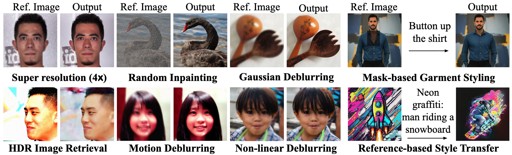
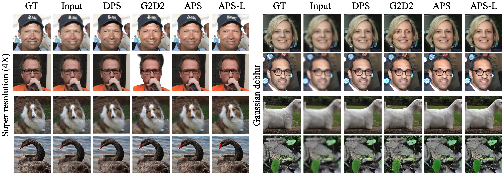
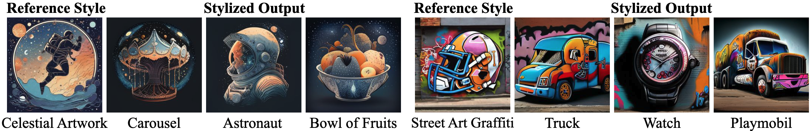

<div align="center">

# Test-Time Anchoring for Discrete Diffusion Posterior Sampling

<a href='https://anchored-discrete-ps.github.io/'></a>
<a href='https://arxiv.org/abs/2510.02291'></a>
[](https://github.com/LituRout/APS)

</div>

We introduce **Anchored Posterior Sampling (APS)** for masked diffusion foundation models, built on two key innovations:

1. **Quantized expectation** — provides gradient-like guidance for discrete diffusion with a purely discrete embedding space.  
2. **Anchored remasking** — enables adaptive decoding by preserving “anchor tokens” aligned with measurements.

APS supports a variety of **linear and nonlinear inverse problems** (super-resolution, deblurring, inpainting, HDR, nonlinear blur) as well as **reference-guided stylization** and **text-guided editing**.

---

## 🚀 Overview



APS achieves **state-of-the-art performance among discrete samplers** and remains competitive with continuous diffusion, while being more efficient at test time.

---

## 🔥 Updates
- **[2025.10.02]** Our paper is now on [ArXiv](https://arxiv.org/abs/2510.02291)!

---

## 📊 Results

### Linear Inverse Problems (FFHQ, ImageNet)

APS produces sharper textures and refined details compared to G2D2 and DPS.



---

### General Inverse Problems (Linear + Nonlinear)

APS generalizes to multiple tasks (motion blur, HDR, nonlinear blur) with large improvements in PSNR and LPIPS.


---

### Stylization and Editing

APS enables **training-free stylization** with a reference style image and prompt.




APS also supports **text-guided block inpainting**:


---

## ⚡ Efficiency

APS demonstrates **better scaling than continuous diffusion samplers** at high resolutions, achieving strong performance with only 15 steps at 1024×1024.

<div align="center">
  
</div>

---

## 📖 Citation

If you find this work useful, please cite:

```bibtex
@article{rout2025aps,
  title     = {Test-Time Anchoring for Discrete Diffusion Posterior Sampling},
  author    = {Rout, L. and Lugmayr, A. and Jafarian, Y. and Varadharajn, S. and Caramanis, C. and Shakkottai, S. and Shlizerman, I.},
  journal   = {arXiv preprint arXiv:2510.02291},
  year      = {2025},
  url       = {https://arxiv.org/abs/2510.02291}     
}

